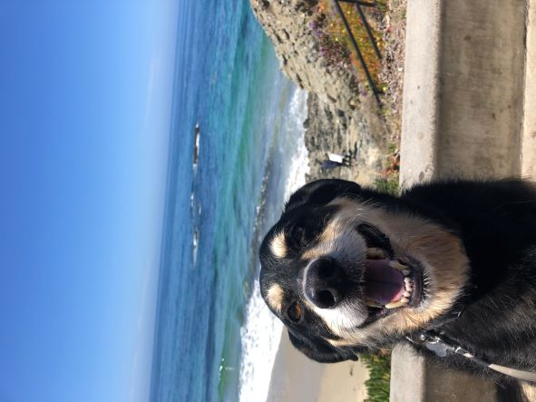

# Personal Website

Hey! My name is _Kai Akamatsu_

**I am interested in applying computer science to medicine and research**

> I have experience with the following programming languages:
>
> - Java
> - Python
> - R
> - Javascript

> I am hoping to make an impact in
>
> - Medical Devices
> - Pharmaceuticals
> - Startups

---

In my freetime, I like to

1. Surf
2. Workout
3. Cook
4. Eat out with friends

Meet my dog!



---

##Lab Reports

[LabReport1](lab-report-1-week-0.html)

---

##Social Media Links

[LinkedIn](https://www.linkedin.com/in/kai-akamatsu/)

```
print(Reach out to)
print(kakamatsu@ucsd.edu) 
```
