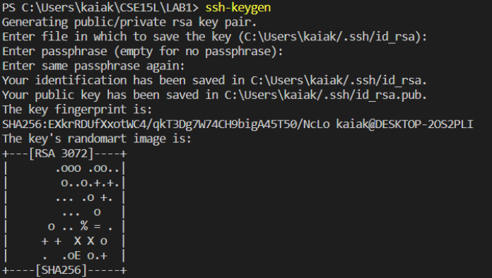

# Week 1 Lab Report: Remote Access

**This is a tutorial on how to log into a course-specific account on ieng6**

## Installing VScode

**First step is to download Visual Studio Code**

- Go to [VS Code Download](https://code.visualstudio.com/Download)
- Click on the correct OS and follow the instructions to download it

## Remotely Connecting

**Next step is to connect to the remote computer**

- If this is your first time remotely connecting, make sure you go to [this link](https://sdacs.ucsd.edu/~icc/index.php) to find your account and reset password
- Open VS code and open a new terminal using the tab at the top of the screen

- In that terminal, type "ssh cs15lfa22zz@ieng6.ucsd.edu" with zz replaced by the letters in your account
- Enter your password and log in. Note that when typing your password there will be no feedback
- Once logged in, you should see text like below

- To log out, run the command "exit"

## Trying Some Commands

- Now lets try some commands on the remote computer
- Below are some commands you could try on both the remote and local computer

1. ls
   > This command should list the contents of the directory. These contents are usually different between the remote and local computer.
2. ls </home/linux/ieng6/cs15lfa22/cs15lfa22zz> replacing zz with someone else's username
   > Trying to list the contents of someone else's remote directory will deny you access because you are not signed in.
3. cp /home/linux/ieng6/cs15lfa22/public/hello.txt ~/
   > Copies a txt file to the user's home folder
4. cat /home/linux/ieng6/cs15lfa22/public/hello.txt
   > prints out the contents of the txt file

See below for the commands and expected outputs:

## Moving Files with scp

- What if we want to move a file from your computer to the remote computer?
- From the directory on your computer where the file is, run this code
  > scp filename cs15lfa22zz@ieng6.ucsd.edu:~/
- Enter your password
- Log into ssh and use the ls command to check if the file was successfully moved

See below for an example:

## Setting an SSH Key

- We can use ssh keys to skip the process of entering our password everytime
- Run the following to create two files: the private key and the public key
- Note: after running ssh-keygen, just press enter for file, passphrase, and passphrase reenter

- log into ssh
- run the following
  > mkdir .ssh
- log out of the server
- run the following on your computer (with your username and path)
  > scp /Users/kaiak/.ssh/id_rsa.pub cs15lfa22@ieng6.ucsd.edu:~/.ssh/authorized_keys

**now you should be able to use ssh and scp without entering the password!**

## Optimizing Remote Running

Below are some tips and tricks to help optimize remote running:

1. copy and paste the username instead of typing it
   > ssh cs15lfa22kv@ieng6.ucsd.edu
2. write commands in quotes after the ssh to directly run it
   > ssh cs15lfa22kv@ieng6.ucsd.edu "ls"

