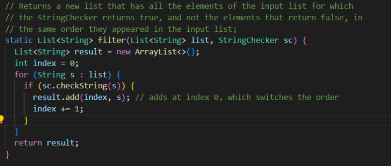

# Week 3 Lab Report: Search Engines and JUNIT testing

## Simple Search Engine

**Below is my code for the search engine implementation**

```java
import java.io.IOException;
import java.net.URI;
import java.util.*;

class Handler implements URLHandler {
    // The one bit of state on the server: a number that will be manipulated by
    // various requests.
    ArrayList<String> array = new ArrayList<String>();

    public String handleRequest(URI url) {
        if (url.getPath().equals("/")) {
            return String.format("There are %d items in the list", array.size());
        } else if (url.getPath().equals("/add")) {
            String[] parameters = url.getQuery().split("=");
            array.add(parameters[1]);
            return String.format("%s added!", parameters[1]);
        } else {
            System.out.println("Path: " + url.getPath());
            if (url.getPath().contains("/search")) {
                String[] parameters = url.getQuery().split("=");
                String key = parameters[1];
                String result = "";
                for (String i : array) {
                    if (i.contains(key)) {
                        result = result + " " + i;
                    }
                }
                return String.format(result);
            }
            return "404 Not Found!";
        }
    }
}

class SearchEngine {
    public static void main(String[] args) throws IOException {
        if (args.length == 0) {
            System.out.println("Missing port number! Try any number between 1024 to 49151");
            return;
        }

        int port = Integer.parseInt(args[0]);

        Server.start(port, new Handler());
    }
}
```

**This server has three functions based on the path:**

- "/" path displays how many strings are in the list
- "/add" adds a certain string into the list
- "/search" looks for words that contain a certain sequences of characters

1. Adding to the list


> Using the "/add?s=String" path+query combination, any string can be added to the list.

> The handleRequest method is called upon loading the page

> The parameter to this method is the url

> Within the url, this code looks at the path and query to operate in different ways

> In this case, the path was "/add", which takes the query (after "?") and splits it at the "="

> The String after the "=" is added to the list

2. Checking the length of the list

> After adding a few more items, going back to the "/" path tells us how many items are in the list.


> This also runs the handleRequest method with the url parameter

> What is different is that path, which is now simply "/"

> This formats a message with the array size

3. Query for a certain sequence of characters


> Again, this runs the handleRequest method with the url

> Now the path of the url is "/search"

> In this case, the query is split at the "=" and the string after the "=" is searched inside the array

> In the list {apple, banana, application, obvious}, this query function searches for "app" and displays "apple application"

## Junit Testing

**For this activity, I used Junit testing to find observe symptoms and find bugs in the code**

1. LinkedList file methods

**Failure-Inducing Input**


> I tested the linkedlist by performing a series of append, prepend, append.

**Symptom**


> The resulting symptom was that there was some kind of infinite loop. The testing never ended.

**Bug**

> The last line of the code (in the while loop) updates the next node with a new Node


> To fix this, I moved that line outside of the while loop


**Explanation**

> When navigating to the end of the linkedlist for the append method, the method keeps adding to the end of the linkedlist while simultaneous looking for a null value (signifying the end). This makes the code run infinitely.

2. Filter method

**Failure-Inducing Input**


> I tested the filter method using a StringChecker that looks for the character "s"

**Symptom**


> It seems like the filter works correctly, but the output is in different order.

**Bug**

> After an element was checked, it was always added to the zero index of the new array


> I fixed this my keeping track of a new index variable that corresponds to the length of the array, which I used to add each item to the end of the array.



**Explanation**

> Since each element was added to the zero index, all elements were essentially prepended to the array, which flipped its order. Instead, we should be adding each element that satisfied the condition to the end of the array so that we can maintain the same order.
