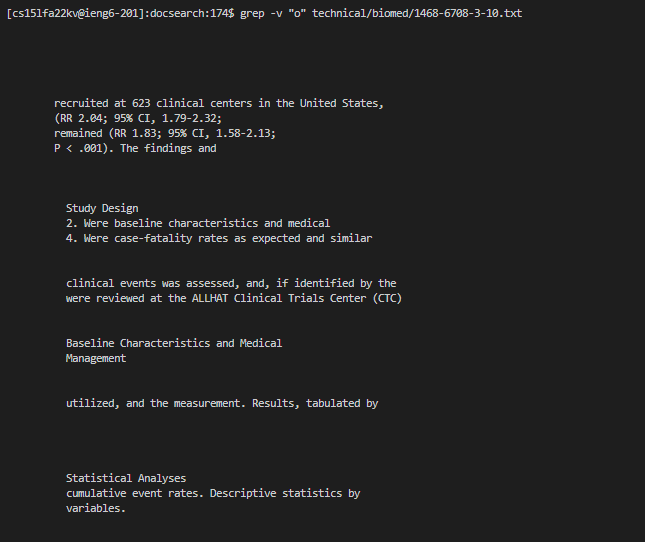
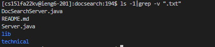
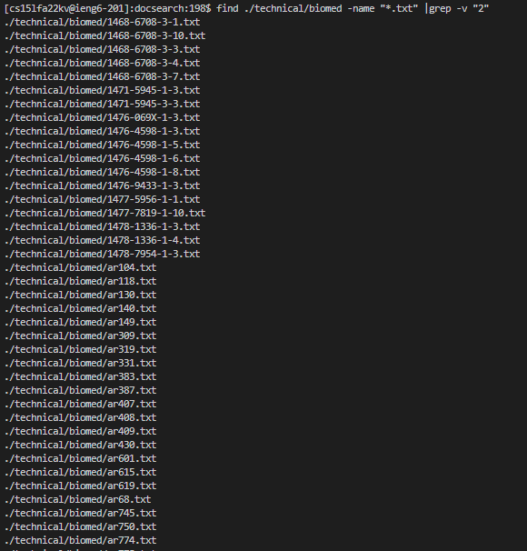
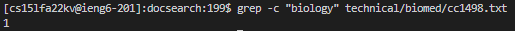
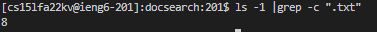
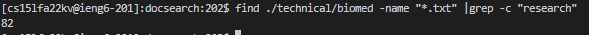
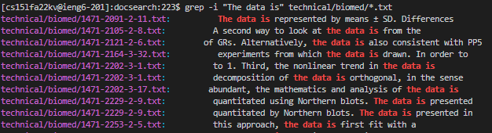
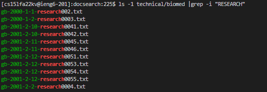
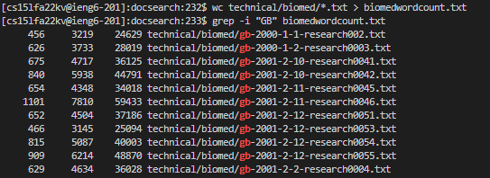

# Week 5 Lab Report: Command-line options

# Grep Command

## Examples of grep -v command

> The grep -v command performs an inverse match which finds lines that do not contain a certain keyword

**Simple grep -v example**

The grep -v command is looking for lines that do not contain the letter "o" in a certain txt file. This command is useful for finding parts of a file that do not talk about a certain topic. For example, I may want to read a biological paper and read every line that does not talk about "natural selection".

**grep -v with ls example**

The ls -1 followed by grep -v ".txt" lists the files and directories in the current working directory that are NOT txt files. This command is useful for finding files that are not a certain type. For example, you may want to list all the files that are not java files in a certain directory.

**grep -v with find example**

The find command followed by grep -v command finds all files following a certain path pattern and lists those that do not have a certain string in its file name. This command is useful for finding all txt files that are not "research" papers.

## Examples of grep -c command

> The grep -c command outputs the counts of matching lines

**Simple grep -c example**

The grep -c command counts the number of lines in a certain file that has a specific key word, in this case "biology." This may be useful if we want to see how many lines contain a word of interest.

**grep -c with ls example**

The ls -1 followed by grep -c ".txt" lists the files and directories in the current working directory and counts all the files that contain a certain key word in its path, in this case ".txt." This may be useful for counting files of a certain type or subject.

**grep -c with find example**

The find command followed by grep -c finds all files following a certain path pattern and counts the number of files that contain a string such as "research" in its path. This command is useful for counting the number of txt files that are concerned with a certain subject.

## Examples of grep -i command

> The grep -i command searches for matches while ignoring uppercase and lowercase.

**Simple grep -i example**

The grep -i command finds all lines that contain a certain key word while ignoring upper and lower case. This may be useful because many text files will contain a specific word at the beginning of a sentence, which a normal grep command would miss due to case sensitivity.

**grep -i with ls example**

The ls -1 followed by grep -i lists the contents of a certain directory and finds files that have a key word in it's path while ignoring uppercase and lowercase. This may be useful because some file and directory names include uppercase and lowercase letters, and a normal grep command may miss some matching files. For example, we may want all files that relate to "research," which would include files that look like research.txt and RESEARCH.txt.

**grep -i with word count**

The wc command counts the nummber of lines, words, and characters in all files following a certain path pattern, and the result is redirected to a new txt file. grep -i is ran on this new txt file to find the line, word and chracter counts of files that contain a key word in its path, regardless of uppercase and lowercase. This may be useful for investigating the size of text files that are related to a certain subject. For example, we may want to see the number of lines in all files that are concerned with "research." This command will be able to find the counts of files that look like research.txt and RESEARCH.txt.
