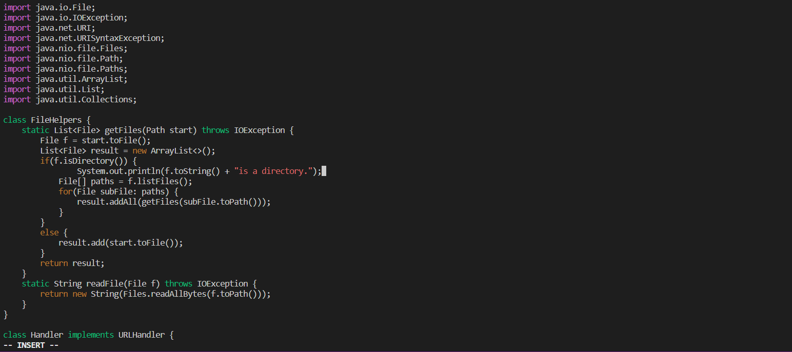

# Week 7 Lab Report: VIM

## Part1: Using vim to add a new line to print

**Below are the key strokes I used**

`/File[<enter><shift>oSystem.out.println(f.toString()+"is a directory.");<escape>:wq<enter>`

1. The `/File[<enter>` moves the cursor to the location shown in the image below
   
2. The `<shift>o` makes a new line in the row above the cursor and enters insert mode
   
3. Then we type the line that we want to add
   
4. Finally, we leave inset mode using the escape key and `:wq<enter>` to save and exit
   

## Part2: SCP vs vim

I first tried making edits on the local computer and used scp to copy the changes over to the remote.

**This took me 55.98 seconds**

Next, I tried using vim in the remote server to save and run changes.

**This took me 47.56**

> I prefer to work on the programs locally and use scp to copy it over because I do not like vim at all. I also would prefer to test locally before using the program remotely.

> A project where I would be making very small changes to a script such as file names would convince me to use vim.
