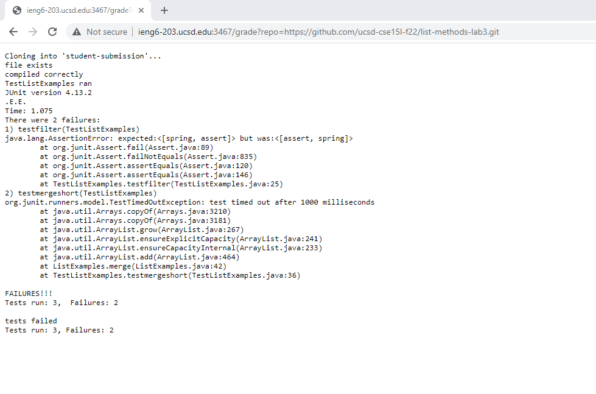
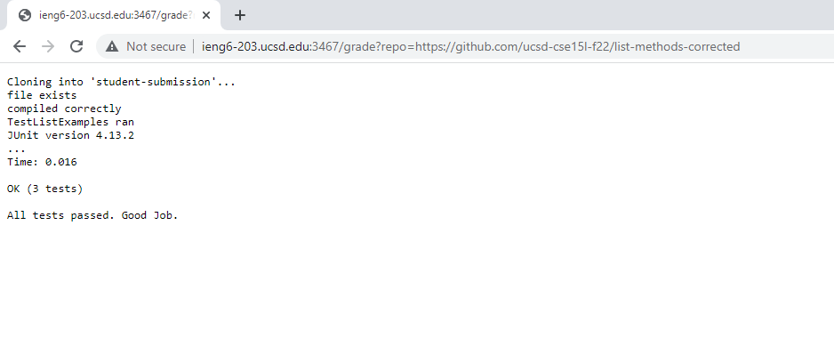
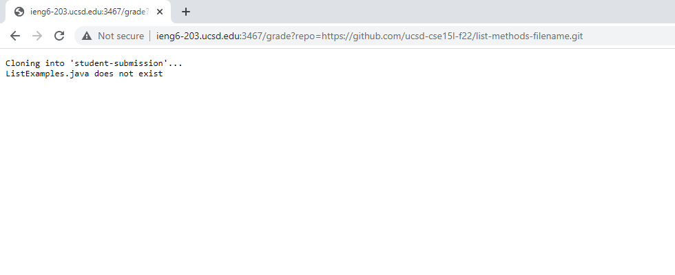

# Week 8 Lab Report: Autograder

## My implementation of grade.sh

```bash
rm -rf student-submission
git clone $1 student-submission

cp TestListExamples.java student-submission

cd student-submission

if ! [[ -f ListExamples.java ]]
then
    echo "ListExamples.java does not exist"
    exit
else
    echo "file exists"
fi

javac -cp .:../lib/hamcrest-core-1.3.jar:../lib/junit-4.13.2.jar *.java

if ! [[ $? -eq 0 ]]
then
   echo "There is a compiler error. No tests ran."
   exit
else
   echo "compiled correctly"
fi

java -cp .:../lib/hamcrest-core-1.3.jar:../lib/junit-4.13.2.jar org.junit.runner.JUnitCore TestListExamples > result.txt

echo "TestListExamples ran"
cat result.txt
failure=$(grep -i "Tests run:" result.txt)

if [[ $failure == "" ]]
then
  echo "All tests passed. Good Job."
else
  echo "tests failed"
  echo $failure
fi
```

## Examples of my script running on a remote broswer

> Grading original implementation from lab 3



> Grading corrected implementation



> Grading wrong file name



## Trace of grading wrong file name

> Below is the identical code block with comments to describe how the wrong file name repository is graded to get the output seen in example 3.

```bash
#the script first deletes the existing student-submission repository so that git clone successfully creates a new directory
rm -rf student-submission
# stdout stderr return code - in chart below

#the first argument to the bash command is the link to the repository.
#git clone command is used to clone that repository into a directory named student-submission
git clone $1 student-submission
# stdout stderr return code - in chart below

#the TestListExamples.java file from the working directory is copied into the new student-submission directory
cp TestListExamples.java student-submission
# stdout stderr return code in chart below

#changes directory to the student submission directory
cd student-submission
# stdout stderr return code in chart below

if ! [[ -f ListExamples.java ]] #this if statement evaluates to true.
#the conditional statement checks if the ListExamples.java file DOES NOT exist.
#Since this is true, the code below the then runs.
then
    echo "ListExamples.java does not exist" #this prints the message that the ListExamples.java file does not exist

    exit #the script ends here due to an early exit

#All lines below this do not run due to the early exit above.

else
    echo "file exists"
fi

javac -cp .:../lib/hamcrest-core-1.3.jar:../lib/junit-4.13.2.jar *.java

if ! [[ $? -eq 0 ]]
then
   echo "There is a compiler error. No tests ran."
   exit
else
   echo "compiled correctly"
fi

java -cp .:../lib/hamcrest-core-1.3.jar:../lib/junit-4.13.2.jar org.junit.runner.JUnitCore TestListExamples > result.txt

echo "TestListExamples ran"
cat result.txt
failure=$(grep -i "Tests run:" result.txt)

if [[ $failure == "" ]]
then
  echo "All tests passed. Good Job."
else
  echo "tests failed"
  echo $failure
fi
```

Chart of stdout stderr and return code

**rm -rf student-submission**

> stdout: nothing - the student-submission folder is deleted from the current directory

> stderr: nothing

> return code: 0

**git clone $1 student-submission**

> stdout: nothing - a new student-submission folder appears from the github repository

> stderr: "Cloning into 'student-submission'..."

> return code: 0

**cp TestListExamples.java student-submission**

> stdout: nothing - a copy of the TestListExamples.java is moved to the student-submission directory

> stderr: nothing

> return code: 0

**cd student-submission**

> stdout: "^[]0;[cs15lfa22] cs15lfa22kv@ieng6-201.ucsd.edu:/home/linux/ieng6/cs15lfa22/cs15lfa22kv list-examples-grader/student-submission^G"

> stderr: nothing

> return code: 0
